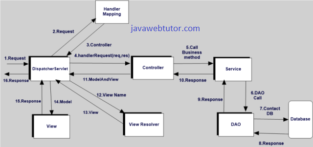

참고: http://javawebtutor.com/articles/spring/spring-mvc-tutorial.php

1. Client(Browser) requests for a Resource in the web Application.

2. The Spring front controller i.e, DispatcherServlet first receives the request.

3. DispatcherServlet consults the HandlerMapping to identify the particular controller for the given URL.

4. HandlerMapping identifies the controller for the given request and sends to the DispatcherServlet.

5. DispatcherServlet will call the handleRequest(request,response) method on Controller. A Controller is developed by writing a simple java class which implements Controller interface or extends its adapter class.

6. Controller will call the business method according to business requirement.

7. Service class will call the DAO class method for business data.

8. DAO interacts with DB to get data.

9. DAO returns same data to service.

10. Fetched data will be processed according to business requirement and return results to Controller.

11. The Controller returns the Model and View in the form of Object back to the Controller i.e, DispatcherServlet.

12. The front controller i.e, DispatcherServlet then tries to resolve the actual View which may be JSP,velocity or Free Marker by consulting the View Resolver Object.

13. ViewResolver selected view is rendred back to the DispatcherServlet.

14. DispatcherServletconsult the particular view with the model.

15. View executes and returns HTML output to the DispatcherServlet.

16. DispatcherServlet will sends the output to the Browser.